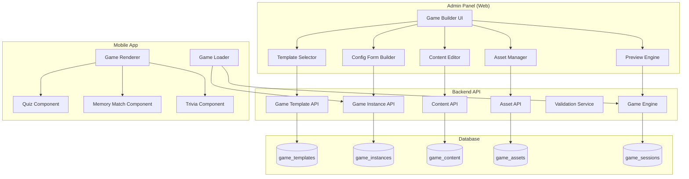
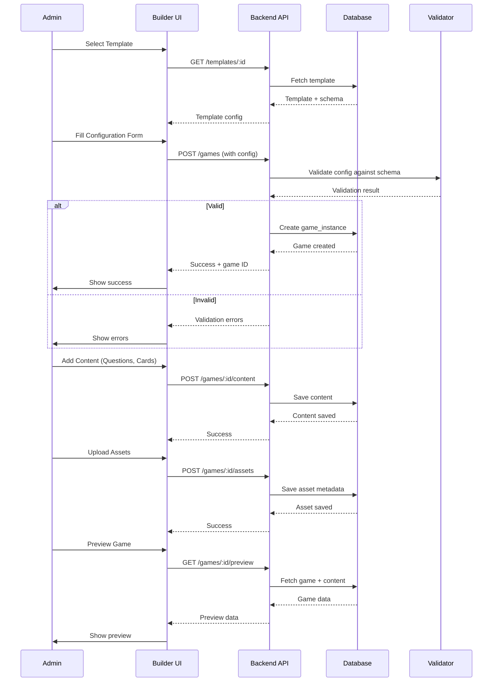
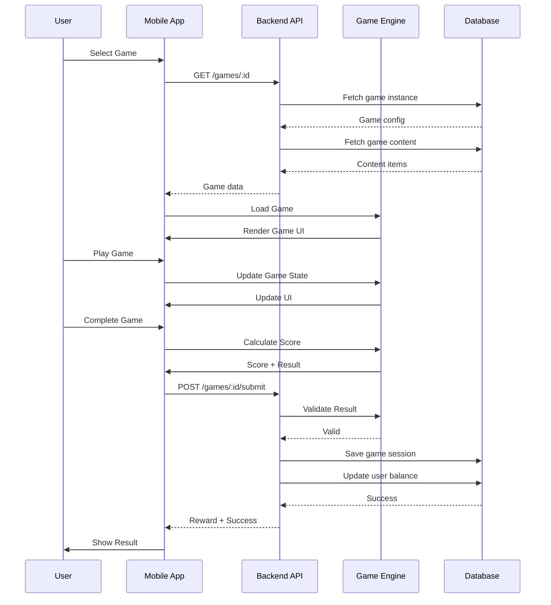
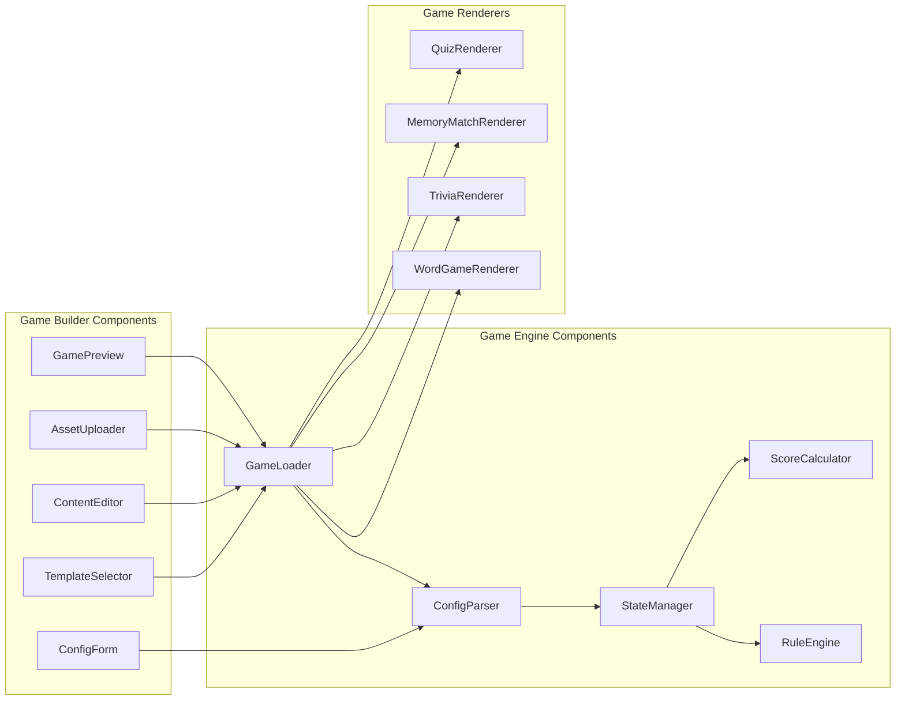
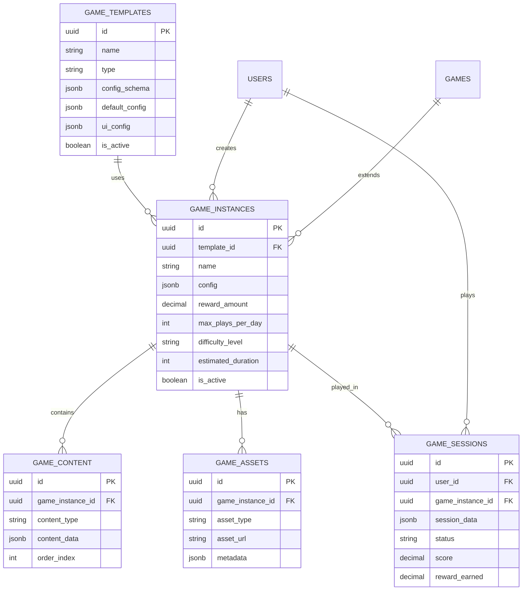

# Low-Code/No-Code Game Builder - Architecture Diagram

## System Architecture

## Data Flow

### 1. Admin Creates Game

### 2. User Plays Game

## Component Diagram

## Database ERD

## Implementation Checklist

### Phase 1: Foundation ✅
- [x] Database schema design
- [ ] Migration file creation
- [ ] Backend API structure
- [ ] Basic validation service

### Phase 2: Template System
- [ ] Template CRUD APIs
- [ ] Template schema validation
- [ ] Default templates (Quiz, Memory Match)
- [ ] Template UI configuration

### Phase 3: Game Builder UI
- [ ] Template selector
- [ ] Dynamic form builder
- [ ] Content editor
- [ ] Asset uploader
- [ ] Preview component

### Phase 4: Game Engine
- [ ] Game loader
- [ ] Config parser
- [ ] State manager
- [ ] Score calculator
- [ ] Rule engine

### Phase 5: Game Renderers
- [ ] Quiz game renderer
- [ ] Memory match renderer
- [ ] Trivia renderer
- [ ] Generic renderer framework

### Phase 6: User Interface
- [ ] Game list screen
- [ ] Game detail screen
- [ ] Game play screens
- [ ] Result screen

### Phase 7: Advanced Features
- [ ] Visual builder
- [ ] Conditional logic
- [ ] Analytics dashboard
- [ ] Leaderboard

