# HMall System Design Documentation

## Table of Contents
1. [System Overview](#system-overview)
2. [Actors](#actors)
3. [Use Cases](#use-cases)
4. [Case Studies](#case-studies)
5. [Use Case Diagrams](#use-case-diagrams)
6. [Activity Diagrams](#activity-diagrams)
7. [Sequence Diagrams](#sequence-diagrams)
8. [Component Diagram](#component-diagram)
9. [Deployment Diagram](#deployment-diagram)
10. [Database Schema](#database-schema)
11. [Project Structure Analysis](#project-structure-analysis)
12. [Module Analysis](#module-analysis)

---

## System Overview

**HMall** is a comprehensive virtual currency management and simulated e-commerce platform that allows users to:
- Manage virtual finances safely
- Experience simulated buying/selling and stock trading
- Earn virtual coins through tasks and games
- Receive AI-powered suggestions for spending and investing
- Track expenses and investments with detailed analytics

### Key Features
- Virtual Currency Management
- Simulated Marketplace
- Task System
- Simulated Stock Trading
- Mini-Games (TicTacToe, Memory Match, etc.)
- AI Recommendations
- Admin Panel
- Reports & Statistics

---

## Actors

### 1. **User (Regular User)**
- **Description**: End users who interact with the mobile application
- **Responsibilities**:
  - Register and authenticate
  - Manage profile and view balance
  - Browse and purchase products
  - Complete tasks to earn coins
  - Trade stocks
  - Play mini-games
  - View recommendations
  - View transaction history and portfolio

### 2. **Admin**
- **Description**: System administrators with elevated privileges
- **Responsibilities**:
  - Manage users (view, grant/revoke coins)
  - Manage products (CRUD operations)
  - Manage tasks (CRUD operations)
  - Manage games (CRUD operations)
  - View system statistics and reports
  - Monitor transactions

### 3. **System (Automated Processes)**
- **Description**: Automated system processes
- **Responsibilities**:
  - Update stock prices periodically
  - Generate AI recommendations
  - Process transactions
  - Validate business rules
  - Maintain data consistency

---

## Use Cases

### User Use Cases

#### UC-1: User Registration
- **Actor**: User
- **Description**: New user creates an account
- **Preconditions**: User has valid email and password
- **Main Flow**:
  1. User opens registration screen
  2. User enters email, password, and full name
  3. System validates input
  4. System creates user account with default balance (1000 coins)
  5. System returns authentication token
- **Postconditions**: User account created, user logged in

#### UC-2: User Login
- **Actor**: User
- **Description**: Existing user authenticates
- **Preconditions**: User account exists
- **Main Flow**:
  1. User enters email and password
  2. System validates credentials
  3. System generates JWT token
  4. System returns token and user information
- **Postconditions**: User authenticated, token stored

#### UC-3: View Dashboard
- **Actor**: User
- **Description**: User views account overview
- **Preconditions**: User is authenticated
- **Main Flow**:
  1. User navigates to dashboard
  2. System retrieves user balance
  3. System retrieves recent transactions
  4. System retrieves AI recommendations
  5. System displays dashboard with all information
- **Postconditions**: Dashboard displayed

#### UC-4: Browse Products
- **Actor**: User
- **Description**: User views available products
- **Preconditions**: User is authenticated
- **Main Flow**:
  1. User navigates to marketplace
  2. System retrieves active products
  3. System displays product list with images, prices, categories
- **Postconditions**: Product list displayed

#### UC-5: Purchase Product
- **Actor**: User
- **Description**: User buys a product with virtual currency
- **Preconditions**: User is authenticated, product exists and is active
- **Main Flow**:
  1. User selects product
  2. User views product details
  3. User selects quantity
  4. User confirms purchase
  5. System validates user balance
  6. System creates order
  7. System deducts virtual currency
  8. System creates transaction record
  9. System updates product stock
  10. System returns success confirmation
- **Alternative Flow 5a**: Insufficient balance
  - 5a.1. System returns error message
  - 5a.2. Use case ends
- **Postconditions**: Order created, balance updated, transaction recorded

#### UC-6: Complete Task
- **Actor**: User
- **Description**: User completes a task to earn virtual coins
- **Preconditions**: User is authenticated, task exists and is active
- **Main Flow**:
  1. User views available tasks
  2. User selects a task
  3. User completes task requirements
  4. User marks task as completed
  5. System validates task completion
  6. System creates user_task record
  7. System awards reward coins
  8. System creates transaction record
  9. System updates user balance
- **Postconditions**: Task completed, coins awarded, balance updated

#### UC-7: Buy Stocks
- **Actor**: User
- **Description**: User purchases stocks with virtual currency
- **Preconditions**: User is authenticated, stock exists and is active
- **Main Flow**:
  1. User views available stocks
  2. User selects a stock
  3. User views stock details and current price
  4. User enters quantity to buy
  5. User confirms purchase
  6. System validates user balance
  7. System calculates total cost
  8. System creates stock transaction
  9. System updates user stock portfolio
  10. System deducts virtual currency
  11. System creates transaction record
- **Alternative Flow 6a**: Insufficient balance
  - 6a.1. System returns error message
  - 6a.2. Use case ends
- **Postconditions**: Stock purchased, portfolio updated, balance updated

#### UC-8: Sell Stocks
- **Actor**: User
- **Description**: User sells owned stocks
- **Preconditions**: User is authenticated, user owns the stock
- **Main Flow**:
  1. User views portfolio
  2. User selects stock to sell
  3. User enters quantity to sell
  4. User confirms sale
  5. System validates user owns sufficient quantity
  6. System calculates sale proceeds
  7. System creates stock transaction
  8. System updates user stock portfolio
  9. System adds virtual currency
  10. System creates transaction record (profit/loss)
- **Alternative Flow 5a**: Insufficient stock quantity
  - 5a.1. System returns error message
  - 5a.2. Use case ends
- **Postconditions**: Stock sold, portfolio updated, balance updated

#### UC-9: Play Mini-Game
- **Actor**: User
- **Description**: User plays a mini-game to earn coins
- **Preconditions**: User is authenticated, game exists and is active
- **Main Flow**:
  1. User navigates to games screen
  2. User selects a game
  3. User plays the game
  4. User completes game (win/loss/draw)
  5. System validates play limits (max plays per day)
  6. System records game play
  7. If user wins, system awards coins
  8. System creates transaction record (if reward earned)
  9. System updates user balance (if reward earned)
- **Postconditions**: Game played, reward awarded if won, balance updated

#### UC-10: View Recommendations
- **Actor**: User
- **Description**: User views AI-generated spending and investment recommendations
- **Preconditions**: User is authenticated
- **Main Flow**:
  1. User navigates to recommendations
  2. System analyzes user transaction history
  3. System analyzes user portfolio
  4. System generates spending recommendations
  5. System generates investment recommendations
  6. System displays recommendations with confidence scores
- **Postconditions**: Recommendations displayed

#### UC-11: View Transaction History
- **Actor**: User
- **Description**: User views all virtual currency transactions
- **Preconditions**: User is authenticated
- **Main Flow**:
  1. User navigates to transactions screen
  2. System retrieves user transactions
  3. System displays transactions with type, amount, date, description
- **Postconditions**: Transaction history displayed

#### UC-12: View Portfolio
- **Actor**: User
- **Description**: User views stock portfolio and performance
- **Preconditions**: User is authenticated
- **Main Flow**:
  1. User navigates to portfolio screen
  2. System retrieves user stock holdings
  3. System calculates current value and profit/loss
  4. System displays portfolio with stock details
- **Postconditions**: Portfolio displayed

#### UC-13: Update Profile
- **Actor**: User
- **Description**: User updates personal information
- **Preconditions**: User is authenticated
- **Main Flow**:
  1. User navigates to profile screen
  2. User edits information (full name, etc.)
  3. User saves changes
  4. System validates input
  5. System updates user profile
- **Postconditions**: Profile updated

### Admin Use Cases

#### UC-14: Manage Users
- **Actor**: Admin
- **Description**: Admin views and manages user accounts
- **Preconditions**: Admin is authenticated
- **Main Flow**:
  1. Admin navigates to users management
  2. System retrieves all users
  3. Admin views user list
  4. Admin can grant/revoke coins to users
- **Postconditions**: User management interface displayed

#### UC-15: Grant/Revoke Coins
- **Actor**: Admin
- **Description**: Admin grants or revokes virtual coins to/from users
- **Preconditions**: Admin is authenticated, user exists
- **Main Flow**:
  1. Admin selects user
  2. Admin enters amount and type (grant/revoke)
  3. Admin confirms action
  4. System validates input
  5. System updates user balance
  6. System creates transaction record
- **Postconditions**: User balance updated, transaction recorded

#### UC-16: Manage Products
- **Actor**: Admin
- **Description**: Admin creates, updates, or deletes products
- **Preconditions**: Admin is authenticated
- **Main Flow**:
  1. Admin navigates to products management
  2. Admin performs CRUD operations on products
  3. System validates input
  4. System updates product database
- **Postconditions**: Products updated

#### UC-17: Manage Tasks
- **Actor**: Admin
- **Description**: Admin creates, updates, or deletes tasks
- **Preconditions**: Admin is authenticated
- **Main Flow**:
  1. Admin navigates to tasks management
  2. Admin performs CRUD operations on tasks
  3. System validates input
  4. System updates task database
- **Postconditions**: Tasks updated

#### UC-18: View System Statistics
- **Actor**: Admin
- **Description**: Admin views system-wide statistics and reports
- **Preconditions**: Admin is authenticated
- **Main Flow**:
  1. Admin navigates to dashboard
  2. System retrieves statistics (total users, transactions, revenue, etc.)
  3. System displays statistics and charts
- **Postconditions**: Statistics displayed

---

## Case Studies

### Case Study 1: New User Journey - First Purchase

**Scenario**: Sarah, a new user, wants to explore the platform and make her first purchase.

**Steps**:
1. Sarah registers with email "sarah@example.com" and password
2. System creates account with 1000 virtual coins (default balance)
3. Sarah logs in and views the dashboard
4. Sarah browses the marketplace and finds a "Virtual Laptop" for 500 coins
5. Sarah views product details and decides to purchase
6. System validates balance (1000 > 500) ✓
7. System creates order, deducts 500 coins, creates transaction
8. Sarah's balance is now 500 coins
9. System suggests completing "First Purchase" task
10. Sarah completes the task and earns 100 coins reward
11. Sarah's final balance: 600 coins

**Outcome**: Successful first purchase, task completion, and coin earning.

### Case Study 2: Stock Trading Strategy

**Scenario**: John wants to build a diversified stock portfolio.

**Steps**:
1. John logs in with balance of 2000 coins
2. John views available stocks:
   - VTECH: 100 coins (trending up +5.26%)
   - VECO: 75.50 coins (down -5.63%)
   - VFIN: 120 coins (up +4.35%)
3. John buys 5 shares of VTECH (500 coins)
4. John buys 10 shares of VECO (755 coins)
5. John's balance: 745 coins remaining
6. After price fluctuations:
   - VTECH increases to 105 coins (John's profit: +25 coins)
   - VECO decreases to 70 coins (John's loss: -55 coins)
7. John sells VTECH at profit (525 coins received)
8. John holds VECO waiting for recovery
9. System generates recommendation: "Consider buying VFIN for diversification"

**Outcome**: Mixed results, learning experience, AI recommendation provided.

### Case Study 3: Task Completion and Game Rewards

**Scenario**: Maria wants to maximize her coin earnings through tasks and games.

**Steps**:
1. Maria logs in with 800 coins
2. Maria views available tasks:
   - Complete Profile: 50 coins
   - Daily Login: 10 coins
   - Stock Trader: 150 coins (requires first stock purchase)
3. Maria completes "Complete Profile" task → earns 50 coins (balance: 850)
4. Maria claims "Daily Login" reward → earns 10 coins (balance: 860)
5. Maria plays TicTacToe game and wins → earns 50 coins (balance: 910)
6. Maria makes a stock purchase to unlock "Stock Trader" task
7. Maria completes "Stock Trader" task → earns 150 coins (balance: 1060)
8. Maria has earned 260 coins total from tasks and games

**Outcome**: Successful coin accumulation through multiple activities.

### Case Study 4: Admin Management Workflow

**Scenario**: Admin needs to manage products and monitor system activity.

**Steps**:
1. Admin logs into admin panel
2. Admin views system statistics:
   - Total users: 150
   - Total transactions: 1,250
   - Total virtual currency in circulation: 500,000 coins
3. Admin creates new product:
   - Name: "Virtual Smartwatch Pro"
   - Price: 350 coins
   - Category: Electronics
   - Stock: 50 units
4. Admin updates existing product price (Virtual Laptop: 500 → 450 coins)
5. Admin views user "sarah@example.com" and grants 200 coins bonus
6. Admin creates new task:
   - Title: "Weekend Warrior"
   - Description: "Complete 3 tasks this weekend"
   - Reward: 75 coins
7. Admin monitors transaction logs for suspicious activity

**Outcome**: Effective system management and content updates.

---

## Use Case Diagrams

### Use Case Diagram - User

```mermaid
%%{init: {'theme':'default', 'themeVariables': {'fontSize':'18px', 'fontFamily':'Arial, sans-serif', 'primaryColor':'#007AFF', 'primaryTextColor':'#000', 'primaryBorderColor':'#007AFF', 'lineColor':'#333', 'secondaryColor':'#E3F2FD', 'tertiaryColor':'#FFF'}}}%%
graph TB
    User[<b>User</b>]
    
    UC1[<b>UC-1: Register</b>]
    UC2[<b>UC-2: Login</b>]
    UC3[<b>UC-3: View Dashboard</b>]
    UC4[<b>UC-4: Browse Products</b>]
    UC5[<b>UC-5: Purchase Product</b>]
    UC6[<b>UC-6: Complete Task</b>]
    UC7[<b>UC-7: Buy Stocks</b>]
    UC8[<b>UC-8: Sell Stocks</b>]
    UC9[<b>UC-9: Play Mini-Game</b>]
    UC10[<b>UC-10: View Recommendations</b>]
    UC11[<b>UC-11: View Transaction History</b>]
    UC12[<b>UC-12: View Portfolio</b>]
    UC13[<b>UC-13: Update Profile</b>]
    UC14[<b>UC-14: Chat with AI</b>]
    UC15[<b>UC-15: Social Feed</b>]
    UC16[<b>UC-16: Direct Messaging</b>]
    UC17[<b>UC-17: View Notifications</b>]
    UC18[<b>UC-18: Expense Management</b>]
    UC19[<b>UC-19: Apply Voucher</b>]
    UC20[<b>UC-20: Manage Budget</b>]
    
    User --> UC1
    User --> UC2
    User --> UC3
    User --> UC4
    User --> UC5
    User --> UC6
    User --> UC7
    User --> UC8
    User --> UC9
    User --> UC10
    User --> UC11
    User --> UC12
    User --> UC13
    User --> UC14
    User --> UC15
    User --> UC16
    User --> UC17
    User --> UC18
    User --> UC19
    User --> UC20
    
    UC4 -.->|includes| UC5
    UC3 -.->|includes| UC10
    UC5 -.->|extends| UC11
    UC7 -.->|extends| UC12
    UC8 -.->|extends| UC12
    UC5 -.->|uses| UC19
    UC13 -.->|includes| UC18
    
    style User fill:#007AFF,stroke:#0051D5,stroke-width:3px,color:#fff
    style UC1 fill:#E3F2FD,stroke:#007AFF,stroke-width:2px
    style UC2 fill:#E3F2FD,stroke:#007AFF,stroke-width:2px
    style UC3 fill:#E3F2FD,stroke:#007AFF,stroke-width:2px
    style UC4 fill:#E3F2FD,stroke:#007AFF,stroke-width:2px
    style UC5 fill:#E3F2FD,stroke:#007AFF,stroke-width:2px
    style UC6 fill:#E3F2FD,stroke:#007AFF,stroke-width:2px
    style UC7 fill:#E3F2FD,stroke:#007AFF,stroke-width:2px
    style UC8 fill:#E3F2FD,stroke:#007AFF,stroke-width:2px
    style UC9 fill:#E3F2FD,stroke:#007AFF,stroke-width:2px
    style UC10 fill:#E3F2FD,stroke:#007AFF,stroke-width:2px
    style UC11 fill:#E3F2FD,stroke:#007AFF,stroke-width:2px
    style UC12 fill:#E3F2FD,stroke:#007AFF,stroke-width:2px
    style UC13 fill:#E3F2FD,stroke:#007AFF,stroke-width:2px
    style UC14 fill:#E3F2FD,stroke:#007AFF,stroke-width:2px
    style UC15 fill:#E3F2FD,stroke:#007AFF,stroke-width:2px
    style UC16 fill:#E3F2FD,stroke:#007AFF,stroke-width:2px
    style UC17 fill:#E3F2FD,stroke:#007AFF,stroke-width:2px
    style UC18 fill:#E3F2FD,stroke:#007AFF,stroke-width:2px
    style UC19 fill:#E3F2FD,stroke:#007AFF,stroke-width:2px
    style UC20 fill:#E3F2FD,stroke:#007AFF,stroke-width:2px
```

### Use Case Diagram - Admin

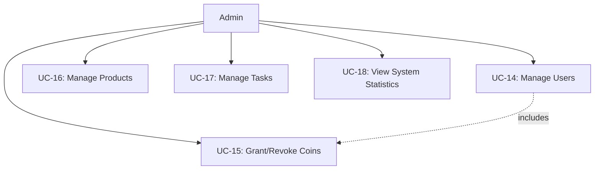

### Use Case Diagram - Complete System

```mermaid
graph TB
    User[User]
    Admin[Admin]
    System[System]
    
    subgraph "User Use Cases"
        UC1[Register]
        UC2[Login]
        UC3[View Dashboard]
        UC4[Browse Products]
        UC5[Purchase Product]
        UC6[Complete Task]
        UC7[Buy Stocks]
        UC8[Sell Stocks]
        UC9[Play Game]
        UC10[View Recommendations]
        UC11[View Transactions]
        UC12[View Portfolio]
        UC13[Update Profile]
    end
    
    subgraph "Admin Use Cases"
        UC14[Manage Users]
        UC15[Grant/Revoke Coins]
        UC16[Manage Products]
        UC17[Manage Tasks]
        UC18[View Statistics]
    end
    
    subgraph "System Use Cases"
        UC19[Update Stock Prices]
        UC20[Generate Recommendations]
        UC21[Process Transactions]
        UC22[Validate Business Rules]
    end
    
    User --> UC1
    User --> UC2
    User --> UC3
    User --> UC4
    User --> UC5
    User --> UC6
    User --> UC7
    User --> UC8
    User --> UC9
    User --> UC10
    User --> UC11
    User --> UC12
    User --> UC13
    
    Admin --> UC14
    Admin --> UC15
    Admin --> UC16
    Admin --> UC17
    Admin --> UC18
    
    System --> UC19
    System --> UC20
    System --> UC21
    System --> UC22
```

---

## Activity Diagrams

### Activity Diagram - Purchase Product

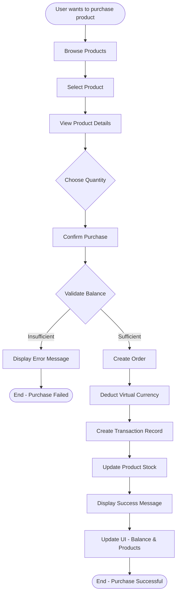

### Activity Diagram - Complete Task

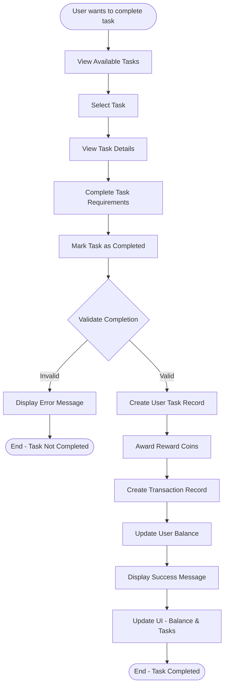

### Activity Diagram - Stock Trading (Buy)

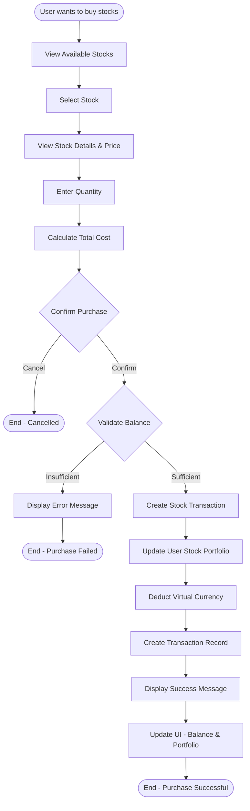

### Activity Diagram - Generate AI Recommendations

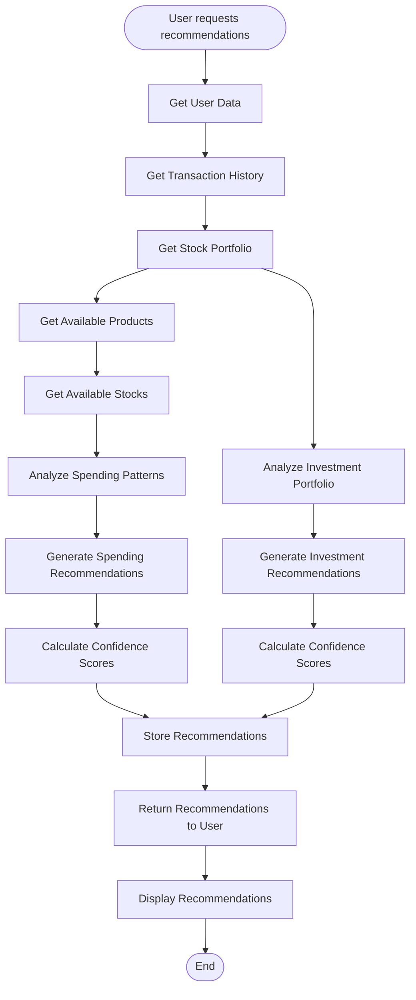

---

## Sequence Diagrams

### Sequence Diagram - User Registration and Login

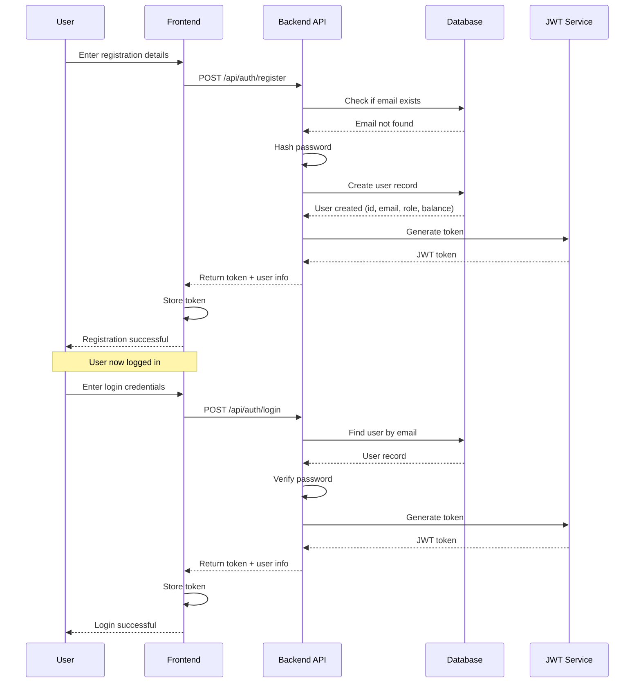

### Sequence Diagram - Purchase Product

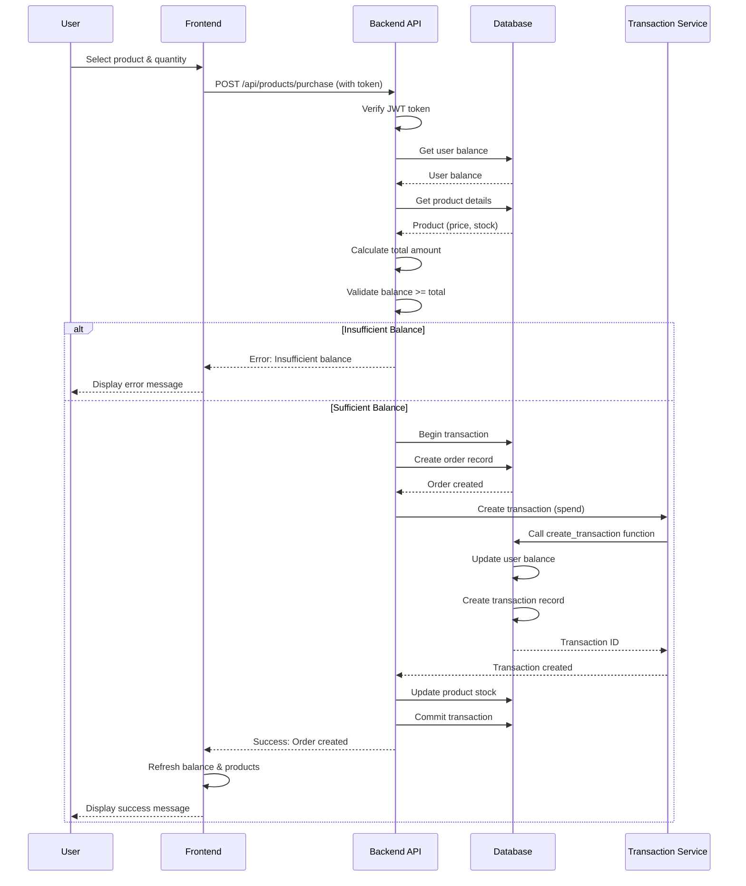

### Sequence Diagram - Complete Task

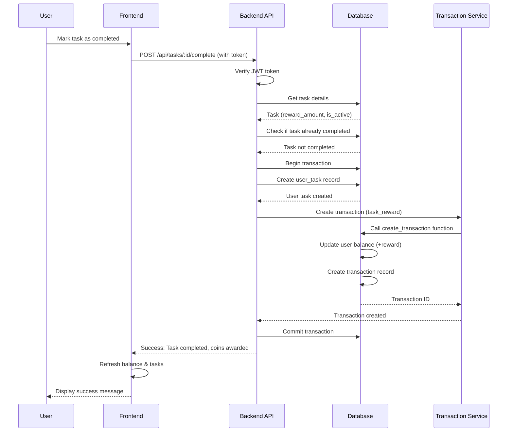

### Sequence Diagram - Buy Stocks

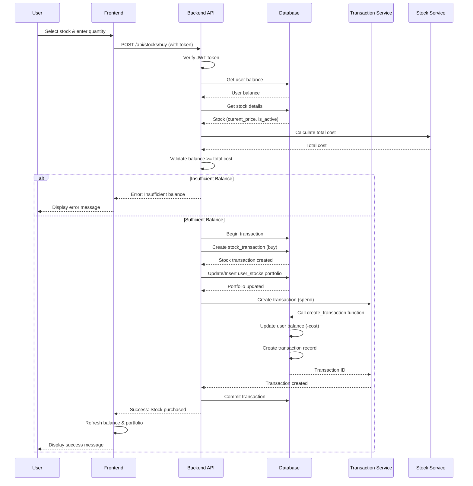

### Sequence Diagram - Get AI Recommendations

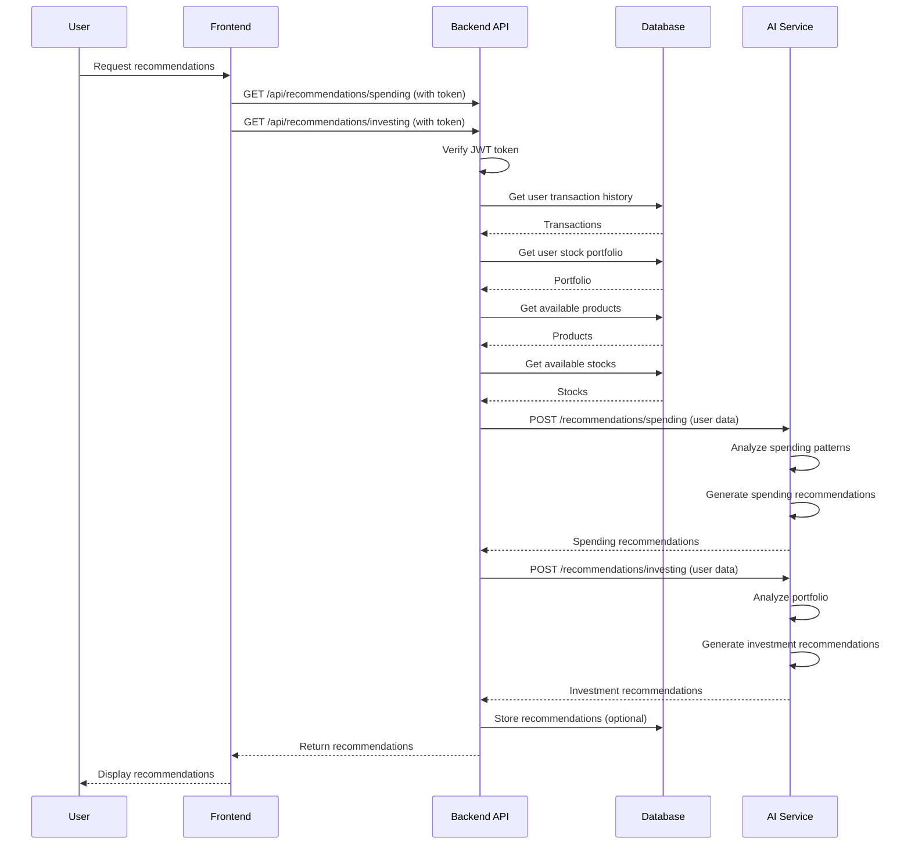

### Sequence Diagram - Admin Grant Coins

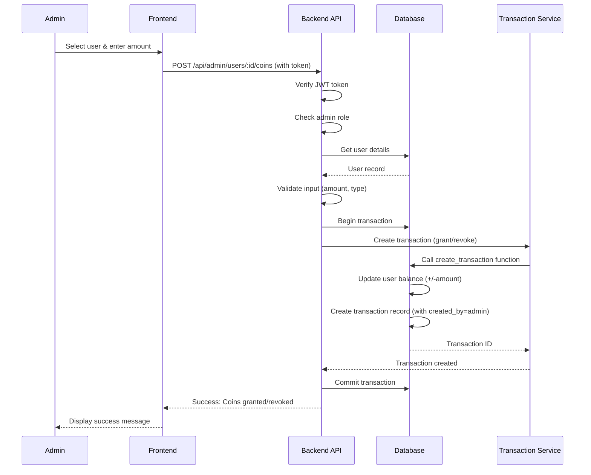

---

## Component Diagram

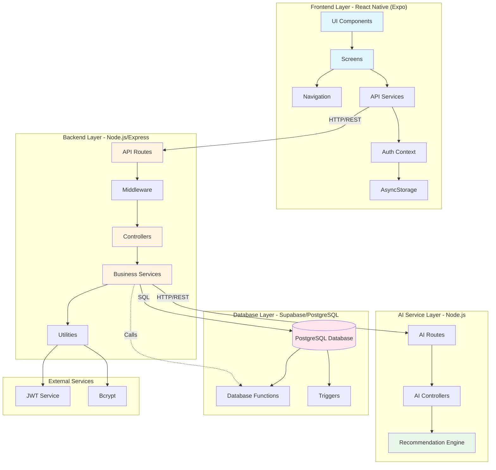

### Component Details

#### Frontend Components
- **UI Components**: Reusable React Native components (buttons, cards, inputs)
- **Screens**: Main application screens (Dashboard, Marketplace, Stocks, Tasks, etc.)
- **Navigation**: React Navigation setup and routing
- **API Services**: Service layer for API calls (auth, products, stocks, tasks, etc.)
- **Auth Context**: React Context for authentication state management
- **AsyncStorage**: Local storage for tokens and user preferences

#### Backend Components
- **API Routes**: Express route definitions (/api/auth, /api/products, etc.)
- **Controllers**: Request handlers that process business logic
- **Middleware**: Authentication, authorization, error handling
- **Business Services**: Core business logic (transaction, stock, game services)
- **Utilities**: Helper functions (JWT, password hashing, Supabase client)

#### AI Service Components
- **Recommendation Engine**: Core AI logic for generating recommendations
- **AI Routes**: API endpoints for recommendation requests
- **AI Controllers**: Request handlers for AI service

#### Database Components
- **PostgreSQL Database**: Main data storage
- **Database Functions**: Stored procedures (create_transaction, etc.)
- **Triggers**: Automated database triggers (update_updated_at, etc.)

---

## Deployment Diagram

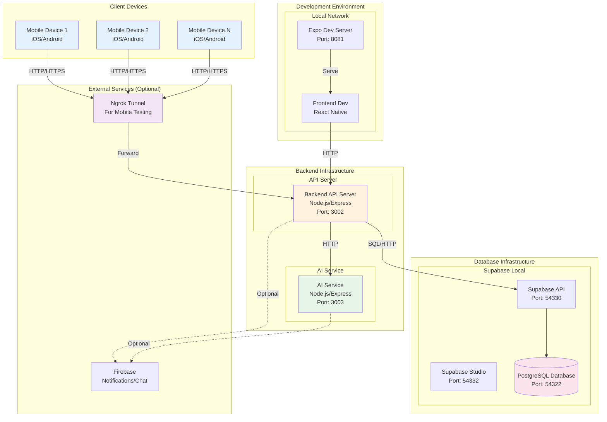

### Deployment Architecture Details

#### Client Layer
- **Mobile Devices**: iOS and Android devices running the React Native Expo app
- **Development**: Expo Dev Server for hot reloading during development

#### Application Layer
- **Backend API Server**: 
  - Node.js with Express framework
  - Handles all business logic and API requests
  - Port: 3002
  - Environment: Development/Production
  
- **AI Service**:
  - Separate Node.js service for recommendation engine
  - Port: 3003
  - Can be scaled independently

#### Data Layer
- **Supabase (PostgreSQL)**:
  - Main database for all application data
  - Supabase API: Port 54330
  - Supabase Studio (Admin UI): Port 54332
  - PostgreSQL: Port 54322
  - Can be deployed to Supabase Cloud for production

#### Network Layer
- **Ngrok**: 
  - Used for exposing local backend to mobile devices during development
  - Provides HTTPS tunnel
  - Not needed in production (use proper domain/SSL)

#### Optional Services
- **Firebase**: 
  - Push notifications
  - Real-time chat (if implemented)
  - Analytics

### Production Deployment Considerations

1. **Frontend**: Build with Expo and deploy to App Store/Play Store
2. **Backend**: Deploy to cloud platform (AWS, Heroku, DigitalOcean, etc.)
3. **Database**: Use Supabase Cloud or managed PostgreSQL
4. **AI Service**: Deploy as separate service or integrate into backend
5. **CDN**: Use CDN for static assets
6. **Load Balancer**: For high availability
7. **SSL/TLS**: HTTPS for all communications
8. **Monitoring**: Application monitoring and logging

---

## Database Schema

### Entity Relationship Diagram

```mermaid
erDiagram
    USERS ||--o{ ORDERS : places
    USERS ||--o{ USER_TASKS : completes
    USERS ||--o{ USER_STOCKS : owns
    USERS ||--o{ STOCK_TRANSACTIONS : makes
    USERS ||--o{ TRANSACTIONS : has
    USERS ||--o{ AI_RECOMMENDATIONS : receives
    USERS ||--o{ USER_GAME_PLAYS : plays
    USERS ||--o{ PRODUCTS : creates
    USERS ||--o{ TASKS : creates
    USERS ||--o{ CONVERSATIONS : participates
    USERS ||--o{ MESSAGES : sends
    USERS ||--o{ DISCUSSION_THREADS : creates
    USERS ||--o{ DISCUSSION_POSTS : posts
    USERS ||--o{ CHAT_CONVERSATIONS : has
    USERS ||--o{ NOTIFICATIONS : receives
    USERS ||--o{ USER_VOUCHERS : claims
    USERS ||--o{ BUDGETS : sets
    USERS ||--o{ SAVINGS_GOALS : creates
    
    PRODUCTS ||--o{ ORDERS : "ordered in"
    TASKS ||--o{ USER_TASKS : "tracked in"
    STOCKS ||--o{ USER_STOCKS : "held in"
    STOCKS ||--o{ STOCK_TRANSACTIONS : "traded in"
    STOCKS ||--o{ STOCK_PRICE_HISTORY : "tracked in"
    GAMES ||--o{ USER_GAME_PLAYS : "played in"
    CONVERSATIONS ||--o{ MESSAGES : contains
    DISCUSSION_THREADS ||--o{ DISCUSSION_POSTS : contains
    VOUCHERS ||--o{ USER_VOUCHERS : claimed
    USERS ||--o{ BUDGETS : sets
    USERS ||--o{ SAVINGS_GOALS : creates
    
    USERS {
        uuid id PK
        string email UK
        string password_hash
        string full_name
        enum role
        decimal virtual_balance
        string avatar_url
        string phone
        text bio
        text address
        date date_of_birth
        timestamp created_at
        timestamp updated_at
    }
    
    PRODUCTS {
        uuid id PK
        string name
        text description
        decimal price
        string image_url
        string category
        int stock_quantity
        boolean is_active
        uuid created_by FK
        timestamp created_at
        timestamp updated_at
    }
    
    ORDERS {
        uuid id PK
        uuid user_id FK
        uuid product_id FK
        int quantity
        decimal total_amount
        enum status
        timestamp created_at
        timestamp updated_at
    }
    
    TASKS {
        uuid id PK
        string title
        text description
        decimal reward_amount
        boolean is_active
        uuid created_by FK
        timestamp created_at
        timestamp updated_at
    }
    
    USER_TASKS {
        uuid id PK
        uuid user_id FK
        uuid task_id FK
        enum status
        timestamp completed_at
        timestamp claimed_at
        timestamp created_at
    }
    
    STOCKS {
        uuid id PK
        string symbol UK
        string name
        decimal current_price
        decimal previous_price
        decimal price_change_percent
        text description
        boolean is_active
        timestamp created_at
        timestamp updated_at
    }
    
    USER_STOCKS {
        uuid id PK
        uuid user_id FK
        uuid stock_id FK
        int quantity
        decimal average_buy_price
        timestamp created_at
        timestamp updated_at
    }
    
    STOCK_TRANSACTIONS {
        uuid id PK
        uuid user_id FK
        uuid stock_id FK
        string transaction_type
        int quantity
        decimal price
        decimal total_amount
        timestamp created_at
    }
    
    STOCK_PRICE_HISTORY {
        uuid id PK
        uuid stock_id FK
        decimal price
        decimal price_change_percent
        timestamp recorded_at
    }
    
    TRANSACTIONS {
        uuid id PK
        uuid user_id FK
        enum type
        decimal amount
        decimal balance_before
        decimal balance_after
        text description
        uuid reference_id
        string reference_type
        uuid created_by FK
        timestamp created_at
    }
    
    GAMES {
        uuid id PK
        string name UK
        text description
        decimal reward_amount
        int max_plays_per_day
        boolean is_active
        timestamp created_at
        timestamp updated_at
    }
    
    USER_GAME_PLAYS {
        uuid id PK
        uuid user_id FK
        uuid game_id FK
        string result
        decimal reward_earned
        jsonb game_data
        timestamp played_at
        timestamp created_at
    }
    
    AI_RECOMMENDATIONS {
        uuid id PK
        uuid user_id FK
        string recommendation_type
        string title
        text description
        string action_type
        uuid action_id
        decimal confidence_score
        boolean is_active
        timestamp created_at
    }
```

### Database Tables Summary

1. **users**: User accounts with authentication and virtual balance
2. **products**: Virtual products available for purchase
3. **orders**: Product purchase orders
4. **tasks**: Tasks users can complete for rewards
5. **user_tasks**: Tracks task completion status per user
6. **stocks**: Simulated stocks available for trading
7. **user_stocks**: User stock portfolio holdings
8. **stock_transactions**: Buy/sell stock transaction history
9. **stock_price_history**: Historical stock price tracking
10. **transactions**: All virtual currency transactions
11. **games**: Mini-games available to play
12. **user_game_plays**: Game play history and results
13. **ai_recommendations**: AI-generated recommendations for users

### Key Relationships

- **Users → Orders**: One-to-many (user can place multiple orders)
- **Users → User_Tasks**: One-to-many (user can complete multiple tasks)
- **Users → User_Stocks**: One-to-many (user can own multiple stocks)
- **Users → Transactions**: One-to-many (user has multiple transactions)
- **Products → Orders**: One-to-many (product can be in multiple orders)
- **Stocks → User_Stocks**: One-to-many (stock can be owned by multiple users)
- **Stocks → Stock_Transactions**: One-to-many (stock has multiple transactions)
- **Games → User_Game_Plays**: One-to-many (game can be played multiple times)

---

## Conclusion

This document provides a comprehensive system design for the HMall platform, covering:
- All actors and their roles
- Detailed use cases for users and admins
- Real-world case studies
- Visual diagrams (Use Case, Activity, Sequence, Component, Deployment)
- Complete database schema

The system is designed to be scalable, maintainable, and user-friendly, with clear separation of concerns between frontend, backend, AI service, and database layers.

---

## Project Structure Analysis

### Root Directory Structure

```
HMall/
├── backend/              # Backend API Server (Node.js/Express)
├── frontend/             # Mobile Application (React Native/Expo)
├── ai-service/           # AI Recommendation Service
├── supabase/             # Database Migrations & Config
├── docs/                 # Documentation
├── scripts/              # Utility scripts
└── [config files]       # Root level configuration
```

### Backend Structure Analysis

#### Directory: `backend/src/`

**Controllers (25 files)** - Request handlers:
- `auth.controller.ts`: Authentication (register, login)
- `user.controller.ts`: User management (balance, transactions, profile)
- `product.controller.ts`: Product CRUD operations
- `task.controller.ts`: Task management
- `stock.controller.ts`: Stock trading operations
- `admin.controller.ts`: Admin operations (grant/revoke coins, stats)
- `recommendation.controller.ts`: AI recommendations
- `voucher.controller.ts`: Voucher management
- `budget.controller.ts`: Budget and savings goals
- `chat.controller.ts`: AI chat functionality
- `social.controller.ts`: Social feed (threads, posts)
- `messaging.controller.ts`: Direct messaging between users
- `game.controller.ts`: Game operations
- `game-template.controller.ts`: Game template management
- `game-instance.controller.ts`: Game instance management
- `game-content.controller.ts`: Game content management
- `notification.controller.ts`: Notification management
- `purchase-history.controller.ts`: Purchase history
- `shopping-cart.controller.ts`: Shopping cart operations
- `transaction-label.controller.ts`: Transaction labeling
- `upload.controller.ts`: File upload (Cloudinary)
- `vendor.controller.ts`: Vendor operations
- `vendor-public.controller.ts`: Public vendor data
- `storage.controller.ts`: Storage operations
- `ai-suggestions.controller.ts`: AI suggestions

**Routes (24 files)** - API endpoint definitions:
- Each route file corresponds to a controller
- RESTful API design
- Authentication middleware applied

**Services (10 files)** - Business logic:
- `transaction.service.ts`: Transaction processing logic
- `stock.service.ts`: Stock price updates and calculations
- `game.service.ts`: Game logic and validation
- `notification.service.ts`: Notification creation and delivery
- `budget.service.ts`: Budget calculations
- `transaction-label.service.ts`: Automatic transaction labeling
- `voucher.service.ts`: Voucher validation and application
- `messaging.service.ts`: Direct messaging logic
- `social.service.ts`: Social feed logic
- `chat.service.ts`: AI chat logic

**Middleware (2 files)**:
- `auth.middleware.ts`: JWT authentication
- `upload.middleware.ts`: File upload handling

**Utils (5 files)**:
- `supabase.ts`: Supabase client initialization
- `jwt.ts`: JWT utilities
- `validation.ts`: Input validation
- `errors.ts`: Error handling
- `logger.ts`: Logging utilities

**Config (1 file)**:
- `env.ts`: Environment variable management

### Frontend Structure Analysis

#### Directory: `frontend/src/`

**Screens (31 files)** - UI screens:

**Auth Screens (2 files)**:
- `LoginScreen.tsx`: User login
- `RegisterScreen.tsx`: User registration

**Main Screens (13 files)**:
- `DashboardScreen.tsx`: Main dashboard with overview
- `MarketplaceScreen.tsx`: Product browsing
- `StocksScreen.tsx`: Stock listing
- `ProfileScreen.tsx`: User profile management
- `TasksScreen.tsx`: Task list and completion
- `GamesScreen.tsx`: Game selection
- `ChatScreen.tsx`: AI chat interface
- `SocialScreen.tsx`: Social feed
- `MessagesScreen.tsx`: Direct messaging
- `NotificationsScreen.tsx`: Notification list
- `NotificationPreferencesScreen.tsx`: Notification settings
- `ExpenseManagementScreen.tsx`: Expense analytics
- `MoreScreen.tsx`: Additional features menu

**Admin Screens (6 files)**:
- `AdminDashboardScreen.tsx`: Admin overview
- `AdminProductsScreen.tsx`: Product management
- `AdminTasksScreen.tsx`: Task management
- `AdminUsersScreen.tsx`: User management
- `AdminGameBuilderScreen.tsx`: Game Builder (Low-code)
- `VoucherManagementScreen.tsx`: Voucher management

**Detail Screens (10 files)**:
- `ProductDetailScreen.tsx`: Product details and purchase
- `StockDetailScreen.tsx`: Stock details and trading
- `PortfolioScreen.tsx`: Investment portfolio
- `TransactionsScreen.tsx`: Transaction history
- `PurchaseHistoryScreen.tsx`: Purchase history
- `ShoppingCartScreen.tsx`: Shopping cart
- `VendorShopScreen.tsx`: Vendor shop view
- `TicTacToeScreen.tsx`: TicTacToe game
- `QuizGameScreen.tsx`: Quiz game

**Vendor Screens (1 file)**:
- `VendorProductsScreen.tsx`: Vendor product management

**Services (20 files)** - API service layer:
- `auth.service.ts`: Authentication API calls
- `user.service.ts`: User-related API calls
- `product.service.ts`: Product API calls
- `stock.service.ts`: Stock API calls
- `task.service.ts`: Task API calls
- `game.service.ts`: Game API calls
- `game-builder.service.ts`: Game Builder API calls
- `recommendation.service.ts`: Recommendation API calls
- `ai-suggestions.service.ts`: AI suggestions API calls
- `voucher.service.ts`: Voucher API calls
- `budget.service.ts`: Budget API calls
- `notification.service.ts`: Notification API calls
- `chat.service.ts`: Chat API calls
- `social.service.ts`: Social feed API calls
- `messaging.service.ts`: Messaging API calls
- `shopping-cart.service.ts`: Shopping cart API calls
- `purchase-history.service.ts`: Purchase history API calls
- `transaction-label.service.ts`: Transaction labeling API calls
- `upload.service.ts`: File upload API calls
- `vendor.service.ts`: Vendor API calls

**Components (5 files)** - Reusable UI components:
- `ImageUploadPicker.tsx`: Image upload component
- `NotificationItem.tsx`: Notification display
- `NotificationToast.tsx`: Toast notifications
- `NotificationToastWrapper.tsx`: Toast wrapper
- `StarRating.tsx`: Star rating component

**Navigation (1 file)**:
- `AppNavigator.tsx`: Navigation structure (Stack + Tabs)

**Context (1 file)**:
- `AuthContext.tsx`: Authentication context provider

**Config (1 file)**:
- `api.ts`: API client configuration

**Utils (1 file)**:
- `price.utils.ts`: Price formatting utilities

### AI Service Structure Analysis

#### Directory: `ai-service/src/`

**ML Models (6 files)**:
- `content-based.ts`: Content-based filtering algorithm
- `collaborative-filtering.ts`: Collaborative filtering algorithm
- `hybrid-recommender.ts`: Hybrid recommendation (combines both)
- `model-storage.ts`: Model persistence (save/load)
- `train.ts`: Model training script
- `train-simple.ts`: Simplified training
- `types.ts`: TypeScript types

**Recommendation API (4 files)**:
- `recommendation.controller.ts`: Recommendation endpoints
- `recommendation.service.ts`: Recommendation logic
- `recommendation.routes.ts`: API routes
- `recommendation.types.ts`: Types

### Database Migrations Analysis

#### Directory: `supabase/migrations/`

**21 Migration Files** - Chronological order:

1. **20250101000000_initial_schema.sql**: Core schema
   - users, products, orders, tasks, stocks, transactions

2. **20250102000000_add_games_and_stock_history.sql**: Games and stock history
   - games, user_game_plays, stock_price_history

3. **20250103000000_add_vendor_role.sql**: Vendor role support
   - Updated users table, vendor-specific features

4. **20250104000000_game_builder_system.sql**: Game Builder
   - game_templates, game_instances, game_content

5. **20250105000000_fix_user_game_plays_foreign_key.sql**: Bug fix

6. **20250106000000_add_product_ratings.sql**: Product ratings
   - product_ratings table

7. **20250107000000_add_transaction_labeling_and_cart.sql**: Transaction labeling
   - transaction_labels, shopping_cart

8. **20250108000000_add_product_discounts.sql**: Discounts
   - product_discounts table

9. **20250109000000_add_notification_system.sql**: Notifications
   - notifications table

10. **20250110000000_add_task_validation_rules.sql**: Task validation
    - Updated tasks table with validation_rules

11. **20250111000000_add_voucher_system.sql**: Voucher system
    - vouchers, user_vouchers tables

12. **20250111000001_add_voucher_claimable_feature.sql**: Voucher claims

13. **20250111000002_add_voucher_featured_and_auto_hide.sql**: Voucher features

14. **20250111000003_add_product_random_voucher_ids.sql**: Product vouchers

15. **20250112000000_add_budget_system.sql**: Budget management
    - budgets, savings_goals tables

16. **20250113000000_add_chat_system.sql**: AI Chat
    - chat_conversations, chat_messages tables

17. **20250114000000_add_social_discussion_system.sql**: Social feed
    - discussion_threads, discussion_posts tables

18. **20250115000000_add_direct_messaging_system.sql**: Direct messaging
    - conversations, messages, conversation_participants, message_reads

19. **20250116000000_disable_messaging_rls.sql**: RLS configuration

20. **20250117000000_add_user_profile_fields.sql**: User profile
    - Added avatar_url, phone, bio, address, date_of_birth to users

### Documentation Structure

#### Directory: `docs/`

**Main Documentation**:
- `SYSTEM_DESIGN.md`: System design documentation (this file)
- `BAO_CAO_DU_AN.md`: Project report (Vietnamese)
- `README.md`: Project overview
- `SETUP.md`: Setup guide
- `TESTING_GUIDE.md`: Testing documentation

**Setup Guides**:
- `SUPABASE_SETUP.md`: Supabase configuration
- `FIREBASE_SETUP.md`: Firebase setup (optional)
- `CLOUDINARY_SETUP.md`: Cloudinary image storage setup

**Feature Guides**:
- `AI_SYSTEM_EXPLANATION.md`: AI system details
- `AI_INTEGRATION_GUIDE.md`: AI integration guide
- `ML_MODELS_GUIDE.md`: ML models guide
- `LOWCODE_GAME_BUILDER.md`: Game Builder documentation
- `LOWCODE_GAME_BUILDER_ARCHITECTURE.md`: Game Builder architecture

**User Guides**:
- `HUONG_DAN_ADMIN.md`: Admin guide (Vietnamese)
- `HUONG_DAN_VENDOR.md`: Vendor guide (Vietnamese)
- `HUONG_DAN_GAME_BUILDER.md`: Game Builder guide (Vietnamese)

**Diagrams**:
- `diagrams/`: Contains 16 diagram files (PNG and SVG formats)
- `DIAGRAM_VIEWING_GUIDE.md`: How to view diagrams
- `README_DIAGRAMS.md`: Diagram documentation

---

## Module Analysis

### Backend Modules

#### 1. Authentication Module
- **Files**: `auth.controller.ts`, `auth.routes.ts`
- **Dependencies**: JWT, bcrypt
- **Features**: Register, login, token generation

#### 2. User Management Module
- **Files**: `user.controller.ts`, `user.routes.ts`
- **Dependencies**: Supabase
- **Features**: Profile, balance, transactions

#### 3. Product Management Module
- **Files**: `product.controller.ts`, `product.routes.ts`
- **Dependencies**: Supabase, Cloudinary
- **Features**: CRUD products, ratings, discounts

#### 4. Stock Trading Module
- **Files**: `stock.controller.ts`, `stock.routes.ts`, `stock.service.ts`
- **Dependencies**: Supabase
- **Features**: Buy/sell stocks, portfolio, price updates

#### 5. Task System Module
- **Files**: `task.controller.ts`, `task.routes.ts`
- **Dependencies**: Supabase
- **Features**: Task CRUD, completion, validation

#### 6. Game System Module
- **Files**: `game.controller.ts`, `game-template.controller.ts`, `game-instance.controller.ts`, `game-content.controller.ts`
- **Dependencies**: Supabase
- **Features**: Game CRUD, Game Builder, play tracking

#### 7. AI Recommendation Module
- **Files**: `recommendation.controller.ts`, `recommendation.routes.ts`
- **Dependencies**: AI Service
- **Features**: Product/investment recommendations

#### 8. Voucher System Module
- **Files**: `voucher.controller.ts`, `voucher.routes.ts`, `voucher.service.ts`
- **Dependencies**: Supabase
- **Features**: Voucher CRUD, claim, apply

#### 9. Budget Management Module
- **Files**: `budget.controller.ts`, `budget.routes.ts`, `budget.service.ts`
- **Dependencies**: Supabase
- **Features**: Budget tracking, savings goals

#### 10. Social Features Module
- **Files**: `chat.controller.ts`, `social.controller.ts`, `messaging.controller.ts`
- **Dependencies**: Supabase, Groq SDK (for AI chat)
- **Features**: AI chat, social feed, direct messaging

#### 11. Notification Module
- **Files**: `notification.controller.ts`, `notification.routes.ts`, `notification.service.ts`
- **Dependencies**: Supabase, Firebase (optional)
- **Features**: Notification creation, delivery, preferences

#### 12. Admin Module
- **Files**: `admin.controller.ts`, `admin.routes.ts`
- **Dependencies**: Supabase
- **Features**: User management, statistics, coin grant/revoke

### Frontend Modules

#### 1. Authentication Module
- **Files**: `LoginScreen.tsx`, `RegisterScreen.tsx`, `auth.service.ts`, `AuthContext.tsx`
- **Features**: Login, register, session management

#### 2. Dashboard Module
- **Files**: `DashboardScreen.tsx`
- **Features**: Overview, quick actions, statistics

#### 3. Marketplace Module
- **Files**: `MarketplaceScreen.tsx`, `ProductDetailScreen.tsx`, `ShoppingCartScreen.tsx`, `product.service.ts`, `shopping-cart.service.ts`
- **Features**: Browse, search, purchase, cart management

#### 4. Stock Trading Module
- **Files**: `StocksScreen.tsx`, `StockDetailScreen.tsx`, `PortfolioScreen.tsx`, `stock.service.ts`
- **Features**: Stock listing, trading, portfolio management

#### 5. Task & Game Module
- **Files**: `TasksScreen.tsx`, `GamesScreen.tsx`, `TicTacToeScreen.tsx`, `QuizGameScreen.tsx`, `task.service.ts`, `game.service.ts`
- **Features**: Task completion, game playing

#### 6. Profile Module
- **Files**: `ProfileScreen.tsx`, `user.service.ts`
- **Features**: Profile management, avatar upload

#### 7. Social Module
- **Files**: `ChatScreen.tsx`, `SocialScreen.tsx`, `MessagesScreen.tsx`, `chat.service.ts`, `social.service.ts`, `messaging.service.ts`
- **Features**: AI chat, social feed, direct messaging

#### 8. Notification Module
- **Files**: `NotificationsScreen.tsx`, `NotificationPreferencesScreen.tsx`, `NotificationItem.tsx`, `notification.service.ts`
- **Features**: Notification display, preferences

#### 9. Expense Management Module
- **Files**: `ExpenseManagementScreen.tsx`, `transaction-label.service.ts`, `budget.service.ts`
- **Features**: Expense analytics, budget tracking

#### 10. Admin Module
- **Files**: `AdminDashboardScreen.tsx`, `AdminProductsScreen.tsx`, `AdminTasksScreen.tsx`, `AdminUsersScreen.tsx`, `AdminGameBuilderScreen.tsx`, `VoucherManagementScreen.tsx`
- **Features**: Admin panel, management screens

### AI Service Modules

#### 1. Content-Based Filtering
- **File**: `content-based.ts`
- **Algorithm**: TF-IDF + Cosine Similarity
- **Use Case**: Product recommendations based on features

#### 2. Collaborative Filtering
- **File**: `collaborative-filtering.ts`
- **Algorithm**: User-Item Matrix + Similarity
- **Use Case**: Recommendations based on user behavior

#### 3. Hybrid Recommender
- **File**: `hybrid-recommender.ts`
- **Algorithm**: Weighted combination of Content-Based and Collaborative
- **Use Case**: Best of both approaches

#### 4. Model Storage
- **File**: `model-storage.ts`
- **Features**: Save/load trained models to/from JSON files


